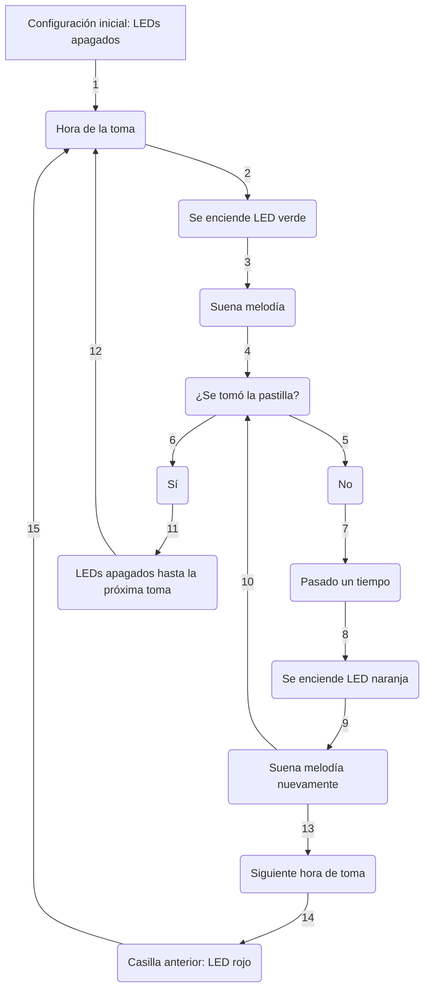

# 
Pastillero-MdN 

  

 

 [![Build with PlatformIO](https://img.shields.io/badge/Compilado%20con-PlatformIO-orange?logo=data%3Aimage%2Fsvg%2Bxml%3Bbase64%2CPHN2ZyB3aWR0aD0iMjUwMCIgaGVpZ2h0PSIyNTAwIiB2aWV3Qm94PSIwIDAgMjU2IDI1NiIgeG1sbnM9Imh0dHA6Ly93d3cudzMub3JnLzIwMDAvc3ZnIiBwcmVzZXJ2ZUFzcGVjdFJhdGlvPSJ4TWlkWU1pZCI+PHBhdGggZD0iTTEyOCAwQzkzLjgxIDAgNjEuNjY2IDEzLjMxNCAzNy40OSAzNy40OSAxMy4zMTQgNjEuNjY2IDAgOTMuODEgMCAxMjhjMCAzNC4xOSAxMy4zMTQgNjYuMzM0IDM3LjQ5IDkwLjUxQzYxLjY2NiAyNDIuNjg2IDkzLjgxIDI1NiAxMjggMjU2YzM0LjE5IDAgNjYuMzM0LTEzLjMxNCA5MC41MS0zNy40OUMyNDIuNjg2IDE5NC4zMzQgMjU2IDE2Mi4xOSAyNTYgMTI4YzAtMzQuMTktMTMuMzE0LTY2LjMzNC0zNy40OS05MC41MUMxOTQuMzM0IDEzLjMxNCAxNjIuMTkgMCAxMjggMCIgZmlsbD0iI0ZGN0YwMCIvPjxwYXRoIGQ9Ik0yNDkuMzg2IDEyOGMwIDY3LjA0LTU0LjM0NyAxMjEuMzg2LTEyMS4zODYgMTIxLjM4NkM2MC45NiAyNDkuMzg2IDYuNjEzIDE5NS4wNCA2LjYxMyAxMjggNi42MTMgNjAuOTYgNjAuOTYgNi42MTQgMTI4IDYuNjE0YzY3LjA0IDAgMTIxLjM4NiA1NC4zNDYgMTIxLjM4NiAxMjEuMzg2IiBmaWxsPSIjRkZGIi8+PHBhdGggZD0iTTE2MC44NjkgNzQuMDYybDUuMTQ1LTE4LjUzN2M1LjI2NC0uNDcgOS4zOTItNC44ODYgOS4zOTItMTAuMjczIDAtNS43LTQuNjItMTAuMzItMTAuMzItMTAuMzJzLTEwLjMyIDQuNjItMTAuMzIgMTAuMzJjMCAzLjc1NSAyLjAxMyA3LjAzIDUuMDEgOC44MzdsLTUuMDUgMTguMTk1Yy0xNC40MzctMy42Ny0yNi42MjUtMy4zOS0yNi42MjUtMy4zOWwtMi4yNTggMS4wMXYxNDAuODcybDIuMjU4Ljc1M2MxMy42MTQgMCA3My4xNzctNDEuMTMzIDczLjMyMy04NS4yNyAwLTMxLjYyNC0yMS4wMjMtNDUuODI1LTQwLjU1NS01Mi4xOTd6TTE0Ni41MyAxNjQuOGMtMTEuNjE3LTE4LjU1Ny02LjcwNi02MS43NTEgMjMuNjQzLTY3LjkyNSA4LjMyLTEuMzMzIDE4LjUwOSA0LjEzNCAyMS41MSAxNi4yNzkgNy41ODIgMjUuNzY2LTM3LjAxNSA2MS44NDUtNDUuMTUzIDUxLjY0NnptMTguMjE2LTM5Ljc1MmE5LjM5OSA5LjM5OSAwIDAgMC05LjM5OSA5LjM5OSA5LjM5OSA5LjM5OSAwIDAgMCA5LjQgOS4zOTkgOS4zOTkgOS4zOTkgMCAwIDAgOS4zOTgtOS40IDkuMzk5IDkuMzk5IDAgMCAwLTkuMzk5LTkuMzk4em0yLjgxIDguNjcyYTIuMzc0IDIuMzc0IDAgMSAxIDAtNC43NDkgMi4zNzQgMi4zNzQgMCAwIDEgMCA0Ljc0OXoiIGZpbGw9IiNFNTcyMDAiLz48cGF0aCBkPSJNMTAxLjM3MSA3Mi43MDlsLTUuMDIzLTE4LjkwMWMyLjg3NC0xLjgzMiA0Ljc4Ni01LjA0IDQuNzg2LTguNzAxIDAtNS43LTQuNjItMTAuMzItMTAuMzItMTAuMzItNS42OTkgMC0xMC4zMTkgNC42Mi0xMC4zMTkgMTAuMzIgMCA1LjY4MiA0LjU5MiAxMC4yODkgMTAuMjY3IDEwLjMxN0w5NS44IDc0LjM3OGMtMTkuNjA5IDYuNTEtNDAuODg1IDIwLjc0Mi00MC44ODUgNTEuODguNDM2IDQ1LjAxIDU5LjU3MiA4NS4yNjcgNzMuMTg2IDg1LjI2N1Y2OC44OTJzLTEyLjI1Mi0uMDYyLTI2LjcyOSAzLjgxN3ptMTAuMzk1IDkyLjA5Yy04LjEzOCAxMC4yLTUyLjczNS0yNS44OC00NS4xNTQtNTEuNjQ1IDMuMDAyLTEyLjE0NSAxMy4xOS0xNy42MTIgMjEuNTExLTE2LjI4IDMwLjM1IDYuMTc1IDM1LjI2IDQ5LjM2OSAyMy42NDMgNjcuOTI2em0tMTguODItMzkuNDZhOS4zOTkgOS4zOTkgMCAwIDAtOS4zOTkgOS4zOTggOS4zOTkgOS4zOTkgMCAwIDAgOS40IDkuNCA5LjM5OSA5LjM5OSAwIDAgMCA5LjM5OC05LjQgOS4zOTkgOS4zOTkgMCAwIDAtOS4zOTktOS4zOTl6bS0yLjgxIDguNjcxYTIuMzc0IDIuMzc0IDAgMSAxIDAtNC43NDggMi4zNzQgMi4zNzQgMCAwIDEgMCA0Ljc0OHoiIGZpbGw9IiNGRjdGMDAiLz48L3N2Zz4=)](https://platformio.org/)

## Patillero automatizado para avisar al usuario de manera visual y sonora de cuando ha de tomarse la pastilla y cual

___

## Índice
- [Introducción](https://github.com/99danirmoya/Salero-MdN/tree/main?tab=readme-ov-file#introducci%C3%B3n)
- [Modo de funcionamiento](https://github.com/99danirmoya/Salero-MdN/tree/main?tab=readme-ov-file#modo-de-funcionamiento)
- [Lista de componentes](https://github.com/99danirmoya/Salero-MdN/tree/main?tab=readme-ov-file#--lista-de-componentes-)
- [Esquemático](https://github.com/99danirmoya/Salero-MdN/tree/main?tab=readme-ov-file#esquem%C3%A1tico)
- [PCB personalizada](https://github.com/99danirmoya/Salero-MdN/tree/main?tab=readme-ov-file#pcb-personalizada)
- [Flujograma](https://github.com/99danirmoya/Salero-MdN/tree/main?tab=readme-ov-file#-flujograma-)
- [Carcasa a medida](https://github.com/99danirmoya/Salero-MdN/tree/main?tab=readme-ov-file#carcasa-a-medida)
- [Modo de implementación](https://github.com/99danirmoya/Salero-MdN/tree/main?tab=readme-ov-file#-modo-de-implementaci%C3%B3n-)
- [Licencia](https://github.com/99danirmoya/Salero-MdN/tree/main?tab=readme-ov-file#-licencia-)
- [Contacto](https://github.com/99danirmoya/Salero-MdN/tree/main?tab=readme-ov-file#-contacto-)

___

## Introducción
  Con el fin de cumplir los objetivos del programa "Jóven Ocúpate Reto TicLab 2024", el equipo de Mar de Niebla se puso en contacto con MediaLab UniOvi para colaborar en el desarrollo de dispositivos electrónicos destinados a ayudar a nuestros mayores.

  Uno de los prototipos propuestos es un pastillero capaz de generar alarmas a las horas estipuladas para que el usuario tome su medicación. Se consideran tres tomas diarias: mañana, tarde y noche. En el momento adecuado, se encenderá un LED verde en la casilla correspondiente y sonará una melodía para llamar la atención del usuario.Al tomarse la pastilla el usuario ha de pulsar el botón de la parte superior del pastillero. Pasado un tiempo prudencial, volverá a sonar la melodía y la luz cambiará a naranja, indicando que el tiempo para tomar la medicación aún es válido, aunque ya se ha pasado del horario recomendado.

  A la hora de la siguiente toma, la casilla anterior se volverá roja, indicando que ya no es aconsejable tomar la medicación de esa hora, y la casilla correspondiente a la nueva toma se volverá verde, reiniciando así el ciclo.
___

## Modo de funcionamiento
### 
 Flujograma 

___

> [!WARNING]
> El pastillero está diseñado para permanecer enchufado en todo momento. En caso de desconectarse, su funcionamiento se reiniciará, lo que hará que todas las casillas queden apagadas hasta que se active la alarma correspondiente.

___

## 
  Lista de componentes 

| Componente | Unidades |
| ------------- | ------------- |
| ESP32 | 1 |
| Buzzer | 1 |
| Botón | 1 |
| Real time clock DS3231 | 1 |
| Tira led | 21 LEDs |

___

## Esquemático

A continuación, se muestra el esquemático para consultar conexiones:

  
  
  <em>Esquemático del pastillero </em>

 

___

## Antecedentes

  A  principios de 2023, se inició un estudio de detección de necesidades entre los vecinos del Barrio Oeste. El equipo Ticlab de Mar de Niebla realizó encuestas para que los propios vecinos pudieran transmitir pequeñas dificultades que podrían resolverse con tecnología. Los datos obtenidos se discutieron en reuniones grupales y se compartieron con MediaLab para fijar un objetivo realizable y con repercusión directa en la comunidad. La decisión fue llevar a cabo dos proyectos que incluyeran diseño, electrónica y programación: uno es un salero y el otro es un pastillero.

Proceso de creación del pastillero inteligente: Para la creación del pastillero inteligente, decidimos hacerlo modular, con dos módulos. El primer módulo es una pieza hueca con forma de semicírculo que contiene toda la electrónica. Tiene un bloque central de 5 cm de altura donde se coloca el Arduino con todo el cableado interno y una tira LED externa. A una altura de 3 cm, y con una separación de 2,4 cm, se encuentran los huecos para los siete botones. La pieza también tiene un encaje exterior para conectar los módulos de los depósitos de las pastillas. En total, la pieza mide 5 cm de alto y 12,8 cm de ancho.

  

  <em>Estructura sin cajones</em>

 
  

  

  <em>Cajón</em>

 
  

  

  <em>Foto real del diseño</em>

 

___

## 
 Modo de implementación 

Toda la explicación del código de Arduino viene dada en el mismo, [`99danirmoya/Salero-MdN/tree/main/src/main.cpp`](https://github.com/99danirmoya/Salero-MdN/blob/main/src/main.cpp), en formato de comentarios al lado de cada línea

___

## 
 Licencia 

Este proyecto está licenciado bajo la [GPL-3.0 license](https://github.com/99danirmoya/turtle-bot-neo?tab=GPL-3.0-1-ov-file).

___

## 
 Contacto 

> [!IMPORTANT]
> Responderemos amablemente a dudas y leeremos sugerencias: 
> 
> Más información sobre nuestras actividades: 

  

 

_
 Autores: Celia Barriocanal García, medialab\_, y el grupo de trabajo de TicLab Jóven Ocúpate, Mar de Niebla :shipit: 
_
